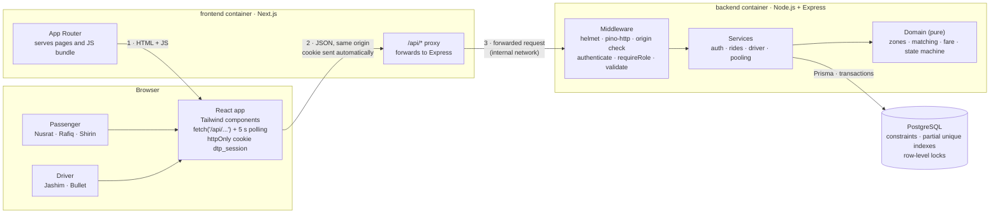
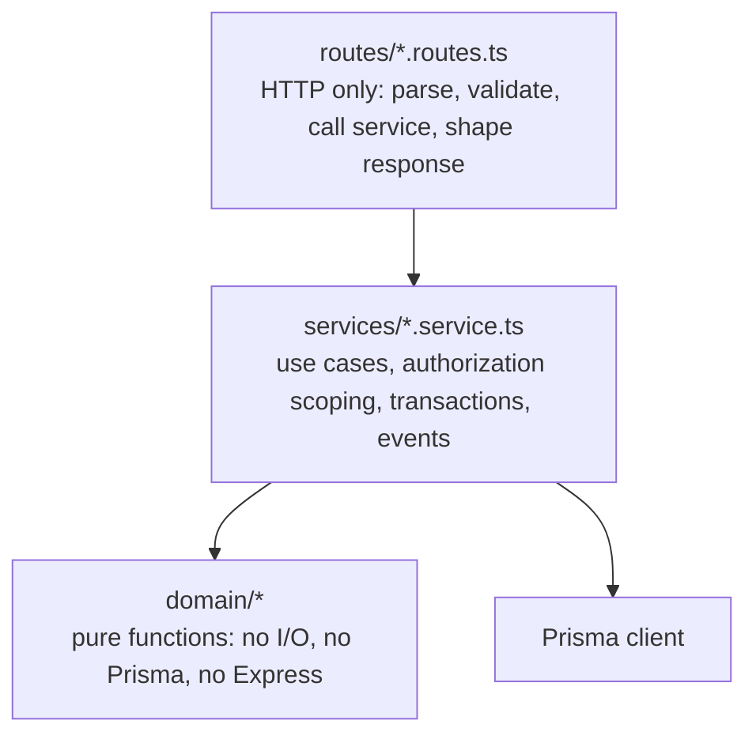
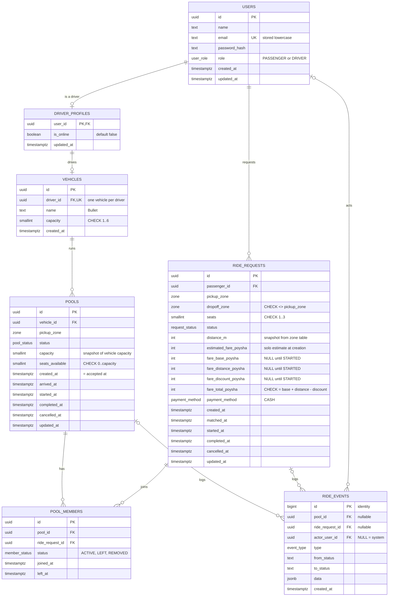
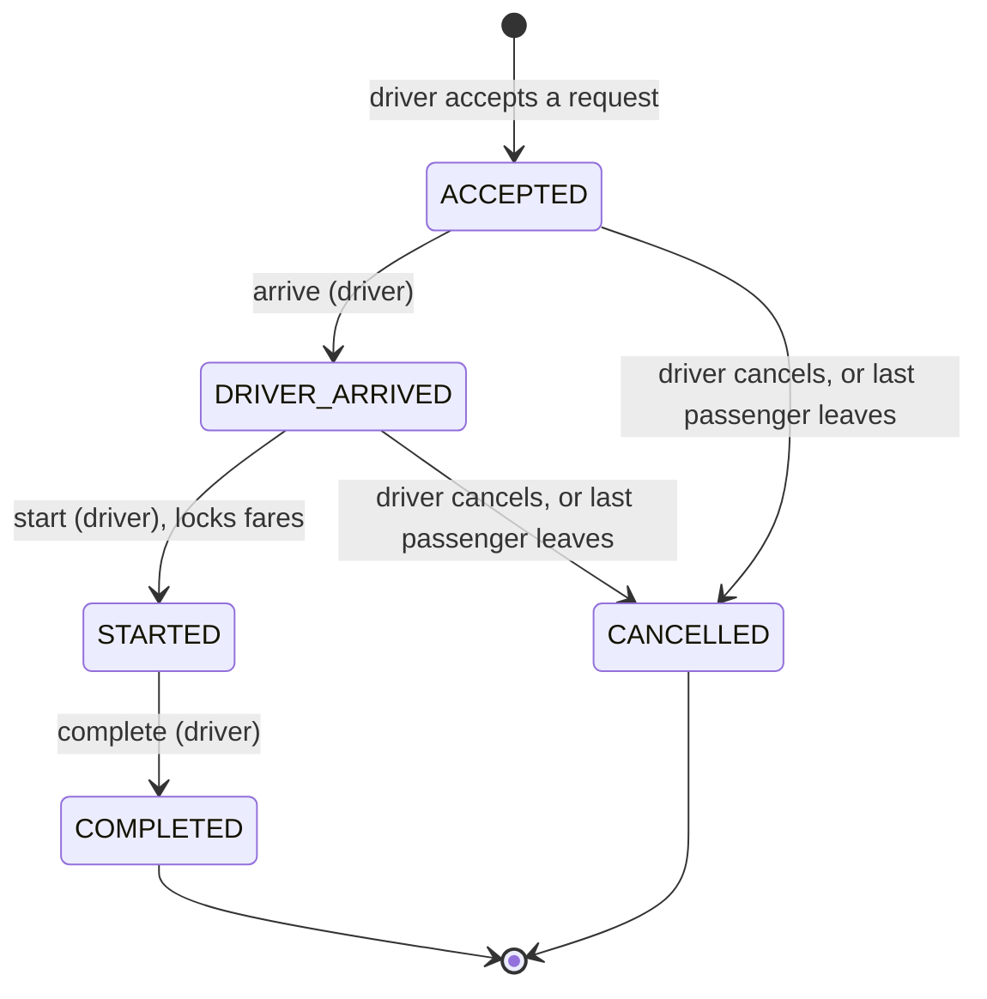
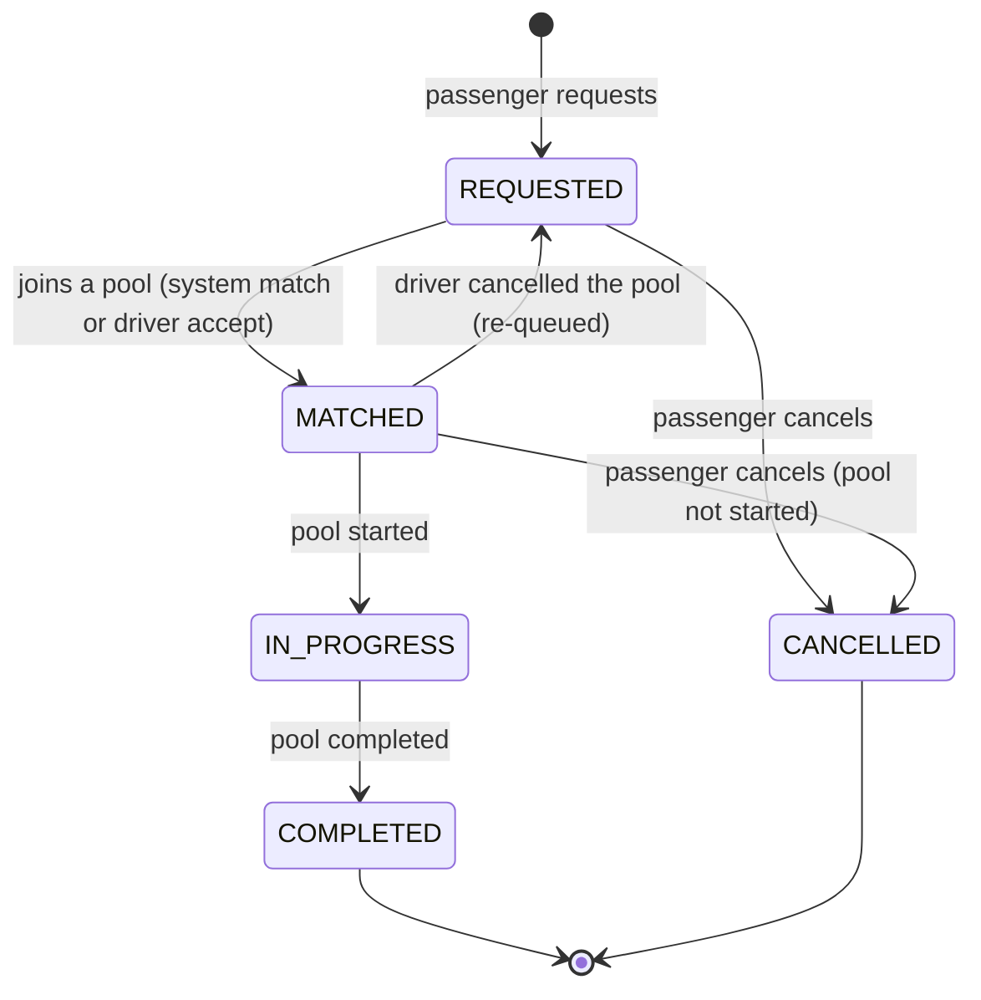
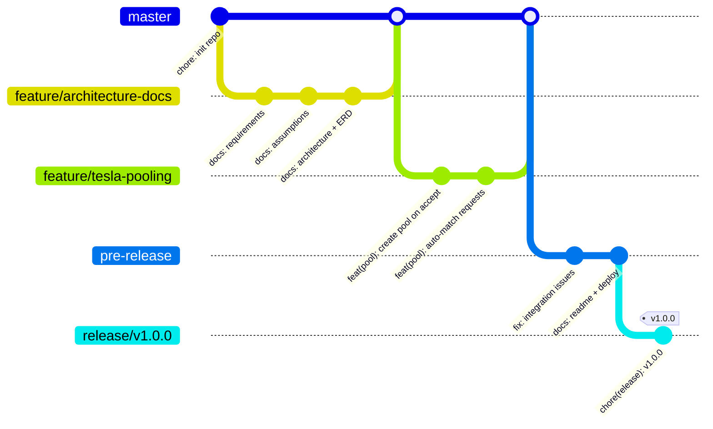

# Architecture

This document describes how Dhaka Tesla Pool is built and why: the system and backend architecture, the database (ERD), the ride and pool lifecycles, the pooling rule, the fare model, the concurrency strategy, the test plan and the Git workflow. Product assumptions live in [`assumptions.md`](assumptions.md).

---

## 1. How decisions are recorded

Every significant choice is written as:

> **Decision** · what we do
> **Alternatives** · realistic options we rejected
> **Why it fits** · the reason for *this* assessment, not in general
> **Would change if** · the concrete signal that makes us revisit

The README "Key decisions" section summarises them.

---

## 2. Tech stack

| Layer | Choice | Responsibility | Why this choice |
|---|---|---|---|
| Frontend | Next.js (App Router) + TypeScript + Tailwind CSS | Pages, routing, calling the API through a same-origin proxy | Mandated React/Next.js; App Router gives file-based routing; Tailwind keeps styling simple |
| Backend | Node.js + Express 5 + TypeScript | HTTP, auth, business rules, transactions | Mandated Node.js; Express is small and transparent; v5 forwards async errors to the error handler natively |
| Database | PostgreSQL 17 | Source of truth, constraints, row locking | Relational integrity, CHECK constraints, partial unique indexes and row-level locks fit a capacity problem |
| ORM | Prisma | Schema, migrations, typed queries, interactive transactions | Typed client and readable migrations; raw SQL still available where needed |
| Validation | Zod | Request bodies, params, query and environment config | One schema gives runtime validation and TypeScript types |
| Auth | JWT + bcrypt, httpOnly cookie | Stateless sessions, password hashing | Simple, no session store; the cookie keeps the token away from page scripts |
| Logging | pino + pino-http | Structured JSON logs with a request id | Fast, standard, searchable |
| Security headers | helmet | Standard HTTP security headers | One line, well maintained |
| Tests | Vitest, Supertest, Playwright | Unit, API integration against real Postgres, browser E2E | Fast TypeScript-native runner; Supertest drives the Express app without a network port |
| Dev runner | tsx (development only) | Runs TypeScript directly in development and for the seed script | Not used in production builds |
| CI | GitHub Actions | Type check, tests and frontend build on every pull request | Free for public repositories |
| Runtime | Docker Compose | `db`, `backend`, `frontend` services | One command to run everything |

`cors` is intentionally absent: the browser only talks to the Next.js origin, which forwards `/api/*` to Express, so there are no cross-origin calls to allow. `cookie-parser` and `express-rate-limit` will be added with authentication.

---

## 3. Key decisions at a glance

| # | Decision | Section |
|---|---|---|
| D-01 | Two deployables (web, api) + one database. No other services. | §5 |
| D-02 | Browser talks only to Next.js; Next.js proxies `/api/*` to Express; session in an httpOnly cookie. | §5 |
| D-03 | Polling (5 s) instead of WebSockets. | §5 |
| D-04 | REST with explicit action endpoints (`/start`, `/cancel`), not `PATCH {status}`. | §6.3 |
| D-05 | Layering: routes → services → pure domain; Prisma used directly in services (no repository layer). | §6.1 |
| D-06 | 404 (not 403) for resources owned by someone else. | §6.4 |
| D-07 | Separate lifecycles for **ride request** (per passenger) and **pool** (per vehicle trip). | §8 |
| D-08 | State transitions executed as conditional `UPDATE ... WHERE status = <from>`. | §8.5 |
| D-09 | Zones as a Postgres enum; distance table as a versioned TypeScript constant. | §9.1 |
| D-10 | Money as integer poysha (`INT`), breakdown stored at lock time. | §10.2 |
| D-11 | Seat claims via a single atomic conditional decrement on a `seats_available` counter, backed by a DB `CHECK`. | §11 |
| D-12 | Consistent lock order: pool row before request row. | §11.6 |
| D-13 | Append-only `ride_events` table for history. | §7 |
| D-14 | Two independent apps in one repo, no workspace tooling or shared package. | §13 |
| D-15 | `--no-ff` merges from feature branches, never squash. | §14 |

---

## 4. Non-goals (deliberately not built)

Real routing or maps, driver GPS, WebSockets, Redis, queues, background workers, microservices, wallet/ledger, ratings, admin panel, notifications, refresh tokens, multi-region anything. Each appears in README "Next improvements" or `docs/scaling.md` with the trigger that would justify it.

---

## 5. System architecture



The React code is served by Next.js and runs in the browser. Every data call goes to the **same origin** (`/api/...`), and Next.js forwards it to Express. The request path is Browser → Next.js/React → Node.js API → Database.

**D-01 · Two deployables and one database**
- **Decision.** `web` (Next.js) and `api` (Express) as separate processes, one PostgreSQL. Nothing else.
- **Alternatives.** (a) Next.js only, using Route Handlers as the backend. (b) Microservices (auth, matching, fares).
- **Why it fits.** The PRD mandates a Node.js backend and evaluates API design separately from frontend. A dedicated Express app keeps business rules in one testable place with Supertest. Microservices would add network failure modes to a problem whose hard part is a single-row race.
- **Would change if.** Matching became CPU-heavy or needed independent scaling; it would be the first thing extracted (see `scaling.md`).

**D-02 · Same-origin proxy with an httpOnly session cookie**
- **Decision.** The browser only calls the Next.js origin. Next.js forwards `/api/*` to Express. Express sets the JWT in an httpOnly `dtp_session` cookie (`SameSite=Lax`, `Secure` in production), which the browser then sends automatically. State-changing API requests must carry an `Origin` header matching the frontend.
- **Alternatives.** Browser calls Express directly with a Bearer token kept in `localStorage`, plus a CORS allowlist.
- **Why it fits.** Page JavaScript can never read the token, so an injected script cannot steal it. The browser sees one origin, so there is no CORS to configure and the cookie is first-party even when frontend and backend are on different hosts. Tests are unaffected: Supertest `agent()` and Playwright both keep cookies.
- **Cost.** One extra hop per request; the proxy target (`API_INTERNAL_URL`) must be known to the Next.js server (R-15). CSRF must be considered, handled by `SameSite=Lax` plus the `Origin` check.
- **Would change if.** A mobile app or third-party clients need the API; then a Bearer-token path would be added alongside the cookie.

**D-03 · Polling, not WebSockets**
- **Decision.** Active-ride screens poll every 5 seconds. Other screens fetch on load and on user action.
- **Alternatives.** WebSockets (Socket.IO), Server-Sent Events.
- **Why it fits.** Status changes are infrequent (a handful per ride). With 4 demo users, polling cost is trivial, it survives free-tier restarts, and it is easy to explain and test. Sticky sessions or a pub/sub layer for sockets would be unjustified here.
- **Would change if.** Latency expectations drop below a few seconds or user count makes polling load significant; SSE is the next step, then WebSockets with a pub/sub fan-out.

**Deployment topology (to be verified at deployment time)**

| Part | Candidate free hosting | Fallback |
|---|---|---|
| web | Vercel Hobby | Same Docker image anywhere |
| api | Render free web service (cold starts expected) | Docker Compose on any VM |
| db | Neon free Postgres | Postgres container |

Free-tier terms change often; they are checked at deployment time and recorded in the README. If any piece is unavailable without a card, the constraint is documented and the reproducible Docker deployment is used instead.

---

## 6. Backend architecture

### 6.1 Layering



| Layer | Knows about | Must not know about | Tested by |
|---|---|---|---|
| Routes | Express, Zod schemas, services | Prisma, business rules | Integration (Supertest) |
| Services | Prisma, domain, auth context | `req`/`res` | Integration |
| Domain | Plain TypeScript values | Anything with I/O | Unit (Vitest), fast and exhaustive |

**D-05 · No repository layer**
- **Decision.** Services call Prisma directly. The rules that matter (fare, matching, transitions) live in `domain/` as pure functions.
- **Alternatives.** Controller → Service → Repository → Prisma (classic layered); NestJS-style modules with DI.
- **Why it fits.** Prisma already is a typed data-access layer; a repository that forwards every call adds files without adding decisions. Putting logic in pure functions gives the testability that repositories usually promise.
- **Would change if.** Queries start being duplicated across services, or we need to swap the ORM.

### 6.2 Request lifecycle inside the API

`request-id → pino-http → helmet → json(limit 10kb) → cookie parsing → origin check (non-GET) → rateLimit(/auth) → authenticate → requireRole → validate(zod) → handler → service → errorHandler`

### 6.3 API surface (REST, versioned under `/api/v1`)

| Method | Path | Role | Purpose |
|---|---|---|---|
| POST | `/auth/register` | public | Create passenger, set session cookie |
| POST | `/auth/login` | public | Set session cookie (passenger or driver) |
| POST | `/auth/logout` | any | Clear session cookie |
| GET | `/auth/me` | any | Current user |
| GET | `/zones` | any | Zone list for dropdowns |
| GET | `/fares/estimate?pickup&dropoff&seats` | passenger | Solo and pooled estimate breakdown |
| POST | `/rides` | passenger | Create request; system tries to pool it |
| GET | `/rides/current` | passenger | Active request with live status/fare |
| GET | `/rides` | passenger | Own history (cursor paginated) |
| GET | `/rides/:id` | passenger | Own request detail + event timeline |
| POST | `/rides/:id/cancel` | passenger | Cancel own request |
| GET | `/driver/me` | driver | Profile, vehicle, online flag |
| POST | `/driver/online` · `/driver/offline` | driver | Availability |
| GET | `/driver/requests` | driver | Relevant waiting requests |
| POST | `/driver/requests/:id/accept` | driver | Create pool or add to open pool |
| GET | `/driver/pools/current` | driver | Active pool, roster, seats |
| GET | `/driver/pools` | driver | Pool history |
| POST | `/driver/pools/:id/arrive` | driver | `ACCEPTED → DRIVER_ARRIVED` |
| POST | `/driver/pools/:id/start` | driver | `DRIVER_ARRIVED → STARTED`, lock fares |
| POST | `/driver/pools/:id/complete` | driver | `STARTED → COMPLETED` |
| POST | `/driver/pools/:id/cancel` | driver | Cancel before start, re-queue passengers |
| GET | `/health` | public | Liveness + DB check (`SELECT 1`) |

**D-04 · REST with action endpoints**
- **Decision.** REST resources; each lifecycle transition is its own `POST` action.
- **Alternatives.** `PATCH /pools/:id {status}`; GraphQL.
- **Why it fits.** One endpoint = one transition = one guard = one test. A generic `PATCH status` invites clients to request arbitrary transitions and pushes validation into a big switch. GraphQL's flexible reads bring little value for a handful of fixed screens, and complicate auth per field.
- **Would change if.** Many clients with varied read needs appeared (GraphQL), or transitions needed a uniform audit API.

### 6.4 Authentication and authorization

- **Authentication.** `POST /auth/login` checks the bcrypt hash (cost 12 in prod, 4 in tests via env), issues a JWT `{ sub: userId, role }` (HS256, 8 h) and sets it as the httpOnly `dtp_session` cookie (`SameSite=Lax`, `Secure` in production). `POST /auth/logout` clears it. `authenticate` middleware reads the cookie, verifies signature and expiry, then attaches `req.user`.
- **CSRF.** Non-GET requests must carry an `Origin` header equal to the configured frontend origin, otherwise `403 BAD_ORIGIN`. Together with `SameSite=Lax` this blocks cross-site form posts.
- **Role checks.** `requireRole('PASSENGER' | 'DRIVER')` per router. Wrong role → `403 FORBIDDEN_ROLE`.
- **Ownership checks.** Done in services by **scoping the query**, never by fetching then comparing:
  - Passenger: `rideRequest.findFirst({ where: { id, passengerId: user.id } })`
  - Driver: `pool.findFirst({ where: { id, vehicle: { driverId: user.id } } })`
  - Not found or not yours → `404 NOT_FOUND`.
- **Response shaping.** Passenger DTOs never include co-riders' names, destinations or fares (A-17). Only `coRiderCount` and `seatsTaken`.

**D-06 · 404 for other people's resources**
- **Decision.** A resource that exists but belongs to someone else returns 404, same as a missing one.
- **Alternatives.** 403.
- **Why it fits.** Does not reveal which ride IDs exist. Scoped queries make this the natural result rather than an extra branch.
- **Would change if.** An admin role needs to distinguish "forbidden" for support tooling.

### 6.5 Validation, errors, logging

- **Validation.** Zod schemas per route for `body`, `params`, `query`; unknown keys stripped (so a smuggled `role` or `status` is ignored). Env vars validated at boot; the process refuses to start with a missing or short `JWT_SECRET`.
- **Error envelope.** `{ "error": { "code": "POOL_FULL", "message": "...", "details": {...} } }`

| HTTP | When | Example codes |
|---|---|---|
| 400 | Schema validation | `VALIDATION_ERROR` |
| 401 | No/invalid/expired token, bad credentials | `UNAUTHENTICATED`, `INVALID_CREDENTIALS` |
| 403 | Wrong role | `FORBIDDEN_ROLE` |
| 404 | Missing or not yours | `NOT_FOUND` |
| 409 | Business-rule or state conflict | `INVALID_TRANSITION`, `ACTIVE_REQUEST_EXISTS`, `REQUEST_ALREADY_MATCHED`, `RIDE_ALREADY_STARTED`, `DRIVER_OFFLINE`, `ACTIVE_POOL_EXISTS`, `SEATS_UNAVAILABLE` |
| 429 | Rate limit | `RATE_LIMITED` |
| 500 | Anything unexpected; no stack trace in body | `INTERNAL` |

- **Error types.** A single `AppError(httpStatus, code, message, details?)`. Prisma unique-violation (`P2002`) on the partial indexes is translated to the matching 409 code; Postgres deadlock / serialization errors map to `409 CONFLICT_RETRY`.
- **Logging.** pino JSON logs, one line per request (method, path, status, latency, `requestId`, `userId`), plus info-level domain events (`pool.created`, `request.matched`, `seat_claim.rejected`). `authorization` header and `password` fields redacted.

### 6.6 Security baseline

bcrypt hashing; JWT secret from env only; JWT in an httpOnly `SameSite=Lax` cookie; `Origin` check on state-changing requests; helmet headers; no CORS (same-origin proxy); 10 kb body limit; rate limit on `/auth/*`; Zod strict parsing; Prisma parameterized queries (the only raw SQL is in migrations); `.env` git-ignored with `.env.example` committed; no stack traces in production responses; register ignores `role` (A-13).

### 6.7 Transactions and event logging

Every state-changing use case runs inside one `prisma.$transaction(async (tx) => ...)`. The same transaction writes the corresponding `ride_events` rows, so history can never disagree with state: either both commit or neither does.

---

## 7. Database design and ERD



### 7.1 Table by table

| Table | Why it exists | Key integrity rules |
|---|---|---|
| `users` | One identity/login table for both roles. | Unique email (lowercased in app). `role` enum. |
| `driver_profiles` | Driver-only attributes (online flag) out of `users`, and a target for FKs that must point at a **driver**. | PK = FK to `users`. `vehicles.driver_id` references this table, so only a driver can own a vehicle. |
| `vehicles` | Bullet and its fixed capacity. | `UNIQUE(driver_id)`; `CHECK (capacity BETWEEN 1 AND 6)`. |
| `pools` | One vehicle trip that one or more requests share. Owns the lifecycle the driver drives. | `CHECK (seats_available BETWEEN 0 AND capacity)`; partial unique `(vehicle_id) WHERE status IN ('ACCEPTED','DRIVER_ARRIVED','STARTED')` = one active pool per Tesla. |
| `ride_requests` | One passenger's intent to travel, their own status, and their own fare. | `CHECK (pickup_zone <> dropoff_zone)`; `CHECK (seats BETWEEN 1 AND 3)`; fare columns all NULL or all set; `CHECK (fare_total = fare_base + fare_distance - fare_discount)`; non-negative money; partial unique `(passenger_id) WHERE status IN ('REQUESTED','MATCHED','IN_PROGRESS')` = one active request per passenger. |
| `pool_members` | Which request is (or was) in which pool. A request can pass through more than one pool if a driver cancels (A-11), so a plain `ride_requests.pool_id` would lose history. | `UNIQUE(pool_id, ride_request_id)`; partial unique `(ride_request_id) WHERE status = 'ACTIVE'` = a request is in at most one pool at a time. |
| `ride_events` | Append-only history that explains "exactly what happened": who did what, when, from which state to which. | `CHECK (pool_id IS NOT NULL OR ride_request_id IS NOT NULL)`. Never updated or deleted by the app. |

### 7.2 Enums

| Enum | Values |
|---|---|
| `user_role` | `PASSENGER`, `DRIVER` |
| `zone` | `BANANI`, `GULSHAN_1`, `GULSHAN_2`, `MOHAKHALI`, `FARMGATE`, `DHANMONDI`, `MIRPUR_10`, `UTTARA`, `BASHUNDHARA` |
| `pool_status` | `ACCEPTED`, `DRIVER_ARRIVED`, `STARTED`, `COMPLETED`, `CANCELLED` |
| `request_status` | `REQUESTED`, `MATCHED`, `IN_PROGRESS`, `COMPLETED`, `CANCELLED` |
| `member_status` | `ACTIVE`, `LEFT` (passenger cancelled), `REMOVED` (pool cancelled by driver) |
| `payment_method` | `CASH` |
| `event_type` | `REQUEST_CREATED`, `REQUEST_MATCHED`, `REQUEST_REQUEUED`, `REQUEST_CANCELLED`, `POOL_CREATED`, `DRIVER_ARRIVED`, `POOL_STARTED`, `FARE_LOCKED`, `POOL_COMPLETED`, `POOL_CANCELLED` |

### 7.3 Indexes (beyond PKs and uniques above)

| Index | Serves |
|---|---|
| `ride_requests (status, pickup_zone, created_at)` | Auto-match sweep and driver's waiting-request feed, oldest first |
| `ride_requests (passenger_id, created_at DESC)` | Passenger history |
| `pools (status, pickup_zone)` | Finding joinable pools for a new request |
| `pools (vehicle_id, created_at DESC)` | Driver history |
| `pool_members (pool_id, status)` | Roster and seat invariant checks |
| `ride_events (ride_request_id, created_at)`, `(pool_id, created_at)` | Timelines |

### 7.4 Database decisions

**UUID primary keys** (except `ride_events`)
- **Alternatives.** Auto-increment integers.
- **Why it fits.** IDs appear in URLs; UUIDs are not guessable, which adds defence in depth on top of scoped queries (it is not a substitute for them). Size cost is irrelevant at MVP scale. `ride_events` uses a bigint identity because it is high-volume, internal and naturally ordered.
- **Would change if.** Index size or write amplification mattered; switch to UUIDv7 or bigint.

**Postgres enums via Prisma**
- **Alternatives.** Lookup tables; `text` + `CHECK`.
- **Why it fits.** The DB rejects invalid statuses and zones with no join, and Prisma generates matching TypeScript unions.
- **Would change if.** Zones became admin-editable (then a `zones` table with FKs).

**Constraints written in SQL where Prisma cannot express them**
- `CHECK` constraints and partial unique indexes are added by hand-editing the generated migration SQL.
- **Risk (R-12).** Prisma's drift detection may not know about hand-written objects. Before relying on them, we confirm how the pinned Prisma version treats them (native support for partial indexes vs raw SQL).

---

## 8. Ride and pool state machine

### 8.1 Why two machines (the "improvement" the PRD invites)

The PRD's suggested lifecycle `REQUESTED → MATCHED/ACCEPTED → DRIVER_ARRIVED → STARTED → COMPLETED (+ CANCELLED)` describes **one** entity. In pooling there are two:

- A **ride request** belongs to one passenger. Nusrat can cancel hers.
- A **pool** belongs to one vehicle trip. Jashim arrives, starts and completes it.

With one shared status, "Rafiq cancels" would either cancel the whole trip (wrong for Nusrat) or leave a status that means different things for different people. Splitting them keeps each machine small and gives each actor exactly one thing they can move. The passenger's displayed status is derived from both: e.g. request `MATCHED` + pool `DRIVER_ARRIVED` shows "Bullet has arrived".

### 8.2 Pool lifecycle (driven by the driver)



| From | To | Actor | Guards | Side effects (same transaction) |
|---|---|---|---|---|
| (none) | `ACCEPTED` | Driver | Driver online; vehicle has no active pool; request is `REQUESTED` and fits capacity | Create pool (capacity snapshot), claim seats, member row, request → `MATCHED`, sweep compatible waiting requests, events |
| `ACCEPTED` | `DRIVER_ARRIVED` | Driver (owner) | ≥ 1 active member | Roster locked (no more joins) |
| `DRIVER_ARRIVED` | `STARTED` | Driver (owner) | ≥ 1 active member | Active requests → `IN_PROGRESS`; fares computed and **locked** |
| `STARTED` | `COMPLETED` | Driver (owner) | none | Active requests → `COMPLETED` |
| `ACCEPTED` / `DRIVER_ARRIVED` | `CANCELLED` | Driver (owner) or system | none | Active members → `REMOVED`; their requests → `REQUESTED` (driver cancel) |

There is no `DRIVER_ARRIVED → ACCEPTED`, no skipping `DRIVER_ARRIVED`, and nothing leaves a terminal state.

### 8.3 Ride request lifecycle (the passenger's view) and driver availability



| From | To | Actor | Guard |
|---|---|---|---|
| `REQUESTED` | `MATCHED` | System / driver | Pool joinable and has seats (§9, §11) |
| `MATCHED` | `REQUESTED` | System | Owning pool cancelled by driver |
| `MATCHED` | `IN_PROGRESS` | System (pool start) | Member `ACTIVE` |
| `IN_PROGRESS` | `COMPLETED` | System (pool complete) | Member `ACTIVE` |
| `REQUESTED`, `MATCHED` | `CANCELLED` | Passenger (owner) | Pool not `STARTED` |

**Passenger-facing labels:** `REQUESTED` → "Waiting for a Tesla" · `MATCHED` + `ACCEPTED` → "Matched · Jashim is on the way" · `MATCHED` + `DRIVER_ARRIVED` → "Bullet has arrived" · `IN_PROGRESS` → "On the way" · `COMPLETED` · `CANCELLED`. This maps onto the waiting → matched → in progress → completed/cancelled.

**Driver availability** is a boolean, not a state machine: `offline ⇄ online`, with the guard that going offline is rejected while the vehicle has an active pool (A-15).

### 8.4 Cancellation matrix

| Who | Request / pool state | Allowed? | Result |
|---|---|---|---|
| Passenger (own) | `REQUESTED` | Yes | Request `CANCELLED` |
| Passenger (own) | `MATCHED`, pool `ACCEPTED` or `DRIVER_ARRIVED` | Yes | Request `CANCELLED`, member `LEFT`, seats released; if pool now empty → pool `CANCELLED` |
| Passenger (own) | `IN_PROGRESS` / `COMPLETED` / `CANCELLED` | No | `409 RIDE_ALREADY_STARTED` / `INVALID_TRANSITION` |
| Passenger (other's) | any | No | `404` |
| Driver (own pool) | `ACCEPTED`, `DRIVER_ARRIVED` | Yes | Pool `CANCELLED`, members `REMOVED`, requests re-queued to `REQUESTED` |
| Driver (own pool) | `STARTED` or terminal | No | `409 INVALID_TRANSITION` |

### 8.5 How transitions are enforced

**D-08 · Transitions as conditional updates**
- **Decision.** Two layers:
  1. `domain/rideStateMachine.ts` holds the allowed-transition tables and `assertTransition(from, to)`. Pure, exhaustively unit-tested.
  2. The service executes each transition as `UPDATE ... SET status = <to> WHERE id = $1 AND status = <from> [AND other guards]` and checks the affected row count. 0 rows → re-read to produce the right 404/409.
- **Alternatives.** Read row, check status in JS, then write (race-prone); Postgres triggers enforcing transitions; a state-machine library (XState).
- **Why it fits.** The pure table makes rules readable and testable; the conditional update makes them race-safe, because two concurrent "start" calls cannot both match `status = 'DRIVER_ARRIVED'`. Triggers would hide business rules inside the database, which is harder to test and explain; XState is overkill for 5 states.
- **Would change if.** The lifecycle grew many states or parallel regions.

---

## 9. Pooling and matching rule

### 9.1 Zones and distances

**D-09 · Zones as enum, distances as a TypeScript constant**
- **Decision.** The 9 zones are a Postgres enum. The distance table lives in `backend/src/domain/zones.ts`, together with its sanity tests. Each ride request stores a `distance_m` snapshot at creation.
- **Alternatives.** `zones` + `zone_distances` tables; lat/long + haversine.
- **Why it fits.** The table is small, rarely changes and is part of the fare rules, so it belongs in reviewed, versioned code next to the fare function. Snapshotting `distance_m` means a future edit never rewrites past fares.
- **Would change if.** Zones became configurable at runtime.

**Approximate road distances (km)**, illustrative, symmetric, not real routing:

| | BAN | GL1 | GL2 | MOH | FRM | DHN | MIR | UTT | BSD |
|---|---|---|---|---|---|---|---|---|---|
| **Banani** | 0 | 4 | 2 | 3 | 7 | 10 | 8 | 13 | 6 |
| **Gulshan 1** | 4 | 0 | 2 | 2 | 6 | 9 | 10 | 15 | 6 |
| **Gulshan 2** | 2 | 2 | 0 | 4 | 8 | 11 | 9 | 13 | 5 |
| **Mohakhali** | 3 | 2 | 4 | 0 | 4 | 7 | 8 | 14 | 7 |
| **Farmgate** | 7 | 6 | 8 | 4 | 0 | 4 | 6 | 17 | 11 |
| **Dhanmondi** | 10 | 9 | 11 | 7 | 4 | 0 | 8 | 20 | 14 |
| **Mirpur 10** | 8 | 10 | 9 | 8 | 6 | 8 | 0 | 12 | 12 |
| **Uttara** | 13 | 15 | 13 | 14 | 17 | 20 | 12 | 0 | 10 |
| **Bashundhara** | 6 | 6 | 5 | 7 | 11 | 14 | 12 | 10 | 0 |

A unit test (U-MATCH-05) asserts symmetry, zero diagonal and the triangle inequality, so the table stays internally consistent if edited.

### 9.2 The rule

```
canJoin(request, pool) =
      pool.status == ACCEPTED
  AND pool.pickupZone == request.pickupZone
  AND pool.seatsAvailable >= request.seats
  AND for every ACTIVE member m of pool:
        distanceKm(m.dropoffZone, request.dropoffZone) <= 3
```

`MAX_DROPOFF_SPREAD_KM = 3` is a named constant. `canJoin` is a pure function in `domain/matching.ts`. The **final** seat check is not this function; it is the atomic claim in §11, because the value read here may already be stale.

### 9.3 Where matching runs

All three entry points call one service function, `assignRequestToPool(tx, requestId, poolId)`, which performs the atomic claim (§11). Nothing else changes `seats_available` except its twin `releaseSeats`.

| Trigger | Behaviour |
|---|---|
| `POST /rides` | Insert request (`REQUESTED`). Find joinable pools (same pickup zone, `ACCEPTED`, enough seats, oldest first), filter with `canJoin`, try to claim the first. If none, stay `REQUESTED`. |
| `POST /driver/requests/:id/accept` | Driver has no active pool: create pool, claim seats for this request, then **sweep**. Driver has an `ACCEPTED` pool: `canJoin` must pass, then claim. |
| Sweep (after pool creation) | Load waiting requests in the pool's pickup zone, oldest first; for each, if `canJoin`, claim; stop when full. |

### 9.4 Relevant requests for the driver (A-16)

Offline → empty list. Online, no active pool → all `REQUESTED`, oldest first. `ACCEPTED` pool → only those where `canJoin(request, pool)`. `DRIVER_ARRIVED` / `STARTED` → empty.

### 9.5 The story, step by step

| t | Event | Result |
|---|---|---|
| 8:41 | Nusrat requests Banani → Mohakhali, 1 seat | No pools exist → `REQUESTED` |
| 8:42 | Jashim (online) accepts Nusrat | Pool P1 on Bullet, capacity 3, `seats_available 2`; Nusrat `MATCHED` |
| 8:43 | Rafiq requests Banani → Gulshan 1, 1 seat | P1: same pickup, 2 free seats, MOH↔GL1 = 2 km ≤ 3 → joins; `seats_available 1` |
| 8:43:30 | Shirin requests Banani → Gulshan 1, 1 seat | GL1↔MOH 2 km, GL1↔GL1 0 km → joins; `seats_available 0` |
| (alt.) | Shirin requests Banani → Gulshan 2 | GL2↔MOH = 4 km > 3 → does not join; stays `REQUESTED` |

---

## 10. Fare model

### 10.1 Formula

```
distanceCharge = divRoundHalfUp(distance_m × RATE_PER_KM, 1000)        // per seat
fareBase       = BASE_FARE × seats
fareDistance   = distanceCharge × seats
subtotal       = fareBase + fareDistance
poolDiscount   = pooled ? divRoundHalfUp(subtotal × POOL_DISCOUNT_BPS, 10000) : 0
fareTotal      = subtotal − poolDiscount

pooled         = the pool has ≥ 2 ACTIVE requests at the moment of evaluation
divRoundHalfUp(n, d) = floor((2n + d) / (2d))                          // integers only
```

Constants (A-29): `BASE_FARE = 5000`, `RATE_PER_KM = 2500`, `POOL_DISCOUNT_BPS = 2000` (20 %). All values in poysha. For `seats = 1` this is exactly the PRD's `baseFare + distanceCharge − poolDiscount`.

`domain/fare.ts` exports one pure function, `calculateFare({ distanceM, seats, pooled }) → { base, distance, discount, total }`, which throws on non-integer or negative inputs.

### 10.2 How money is stored

**D-10 · Integer poysha**
- **Decision.** Every amount is an `INT` column in poysha (`*_poysha`). The API returns poysha integers; the frontend formats to ৳ with two decimals.
- **Alternatives.** `NUMERIC(10,2)` taka; JavaScript `number` in taka; a money library.
- **Why it fits.** Integer arithmetic is exact in both Postgres and JavaScript (well below 2^53), so `0.1 + 0.2` problems cannot occur and the stored breakdown always adds up (enforced by a `CHECK`). `NUMERIC` is exact too, but Prisma returns it as a `Decimal` object, which adds conversions everywhere for no benefit here. `INT` holds up to about ৳21 million per value; aggregates are summed as `bigint` in SQL.
- **Would change if.** Multiple currencies (add a currency column; still minor units), or per-value amounts that could exceed `INT` (move to `BIGINT`).

### 10.3 Worked example (hand-checkable)

| Passenger | Trip | km | Seats | Base | Distance | Subtotal | Pooled? | Discount (20 %) | **Total** |
|---|---|---|---|---|---|---|---|---|---|
| Nusrat | Banani → Mohakhali | 3 | 1 | 5000 | 3 × 2500 = 7500 | 12500 | yes | 2500 | **10000 = ৳100.00** |
| Rafiq | Banani → Gulshan 1 | 4 | 1 | 5000 | 4 × 2500 = 10000 | 15000 | yes | 3000 | **12000 = ৳120.00** |
| Nusrat (solo) | Banani → Mohakhali | 3 | 1 | 5000 | 7500 | 12500 | no | 0 | **12500 = ৳125.00** |
| Rafiq (solo) | Banani → Gulshan 1 | 4 | 1 | 5000 | 10000 | 15000 | no | 0 | **15000 = ৳150.00** |
| Shirin (story) | Banani → Gulshan 1 | 4 | 1 | 5000 | 10000 | 15000 | yes | 3000 | **12000 = ৳120.00** |
| Rafiq (concurrency scenario, 2 seats) | Banani → Gulshan 1 | 4 | 2 | 10000 | 20000 | 30000 | yes | 6000 | **24000 = ৳240.00** |

Pooling saves Nusrat ৳25 and Rafiq ৳30; Jashim collects ৳220 from the pair.

### 10.4 When fares are computed

| Moment | What | Stored? |
|---|---|---|
| `GET /fares/estimate` | Solo and "if pooled" breakdowns | No |
| `POST /rides` | Solo estimate | `estimated_fare_poysha` |
| While `MATCHED` | Live estimate, `pooled` = current active member count ≥ 2 | No (computed on read) |
| Pool `STARTED` | Final breakdown for each active request | `fare_*_poysha` columns + `FARE_LOCKED` event with constants used |

Locked fares are never recomputed. Changing constants later cannot alter history (A-29).

---

## 11. Concurrency: "one seat left, two simultaneous requests"

### 11.1 The problem

Bullet's pool holds Rafiq with 2 seats (`seats_available = 1`). Nusrat and Shirin, both compatible, submit at the same instant. A naive implementation:

```
seats = SELECT seats_available FROM pools WHERE id = P      -- both read 1
if seats >= 1:                                              -- both pass
    UPDATE pools SET seats_available = seats - 1            -- both write 0
    INSERT pool_members ...                                 -- both inserted: 4 people in 3 seats
```

This is a classic read-check-write race. Both checks were correct when they ran; the data changed between check and write.

### 11.2 Options considered

| Option | How | Pros | Cons |
|---|---|---|---|
| A. **Atomic conditional decrement** | `UPDATE pools SET seats_available = seats_available - n WHERE id = P AND status = 'ACCEPTED' AND seats_available >= n` and check row count | One statement; check and write are the same operation; no retry loop; works at default isolation; expressible in plain Prisma (`updateMany` + `decrement`) | Denormalized counter must be kept in sync with members |
| B. Pessimistic lock + recount | `SELECT ... FOR UPDATE` on the pool row, then `SUM(seats)` of active members, then insert | No counter to drift | Needs raw SQL in Prisma; two steps to explain; holds a lock across more code |
| C. `SERIALIZABLE` isolation | Run the naive code at serializable; retry on `40001` | Correct for any logic | Needs a retry loop; failures are non-obvious; more contention |
| D. Optimistic version column | `UPDATE ... WHERE version = v` | Common pattern | Losers must retry; more code for the same result as A |
| E. In-process mutex | Lock in Node memory | Simple | Wrong the moment there are 2 API instances |
| F. Redis / distributed lock | External lock | Works across instances | Prohibited complexity for this MVP |

### 11.3 Decision

**D-11 · Atomic conditional decrement with a database backstop**
- **Decision.** Option A, inside a transaction, plus `CHECK (seats_available BETWEEN 0 AND capacity)` as a last line of defence.
- **Why it fits.** The invariant "occupied seats never exceed capacity" is enforced by the database at the moment of writing, not by code that read a value earlier. The whole mechanism is one SQL statement, so it is easy to reason about and to review.
- **Would change if.** See §11.8.

### 11.4 The claim, step by step

```sql
BEGIN;  -- READ COMMITTED (Postgres default)

-- 1. Claim seats. This row lock is where concurrent claimers queue.
UPDATE pools
   SET seats_available = seats_available - $seats, updated_at = now()
 WHERE id = $pool_id
   AND status = 'ACCEPTED'
   AND seats_available >= $seats;
-- 0 rows → full or no longer joinable → ROLLBACK (request stays REQUESTED)

-- 2. Claim the request. Stops a request being placed twice.
UPDATE ride_requests
   SET status = 'MATCHED', matched_at = now()
 WHERE id = $request_id AND status = 'REQUESTED';
-- 0 rows → already matched or cancelled → ROLLBACK

-- 3. Membership + history
INSERT INTO pool_members (pool_id, ride_request_id, status) VALUES ($pool_id, $request_id, 'ACTIVE');
INSERT INTO ride_events (...) VALUES (...);

COMMIT;
```

In Prisma, step 1 is `tx.pool.updateMany({ where: { id, status: 'ACCEPTED', seatsAvailable: { gte: seats } }, data: { seatsAvailable: { decrement: seats } } })`, and `count === 0` throws, rolling back the interactive transaction.

### 11.5 Why it works: the timeline

| Time | Tx N (Nusrat) | Tx S (Shirin) | `seats_available` |
|---|---|---|---|
| t1 | `UPDATE ... WHERE seats_available >= 1` → locks row, 1 row updated | | 0 (uncommitted) |
| t2 | | `UPDATE ... WHERE seats_available >= 1` → **waits** for N's row lock | 0 (uncommitted) |
| t3 | claim request, insert member, `COMMIT` | | 0 |
| t4 | | Postgres re-checks the `WHERE` against the **committed** row: `0 >= 1` is false → **0 rows** | 0 |
| t5 | | throw → `ROLLBACK`; Shirin stays `REQUESTED` ("waiting for a Tesla") | 0 |

Under `READ COMMITTED`, when an `UPDATE` finds a row locked by another transaction, it waits, and if that transaction commits it re-evaluates its `WHERE` clause on the new row version. That re-evaluation is the whole trick: the check and the write are one atomic step.

If a code bug ever skipped the `WHERE` guard, the `CHECK (seats_available >= 0)` would reject the write and the transaction would fail instead of overbooking (I-DB-01).

### 11.6 Lock ordering (D-12)

Every transaction that touches both a pool and a request locks the **pool row first, then request rows**. This applies to join, passenger cancel, driver cancel, start and complete. With a single global order, two transactions cannot each hold what the other needs, so deadlocks should not occur. If Postgres still aborts a transaction (`40P01` deadlock or `40001` serialization), the API returns `409 CONFLICT_RETRY` and the client can retry.

Example, passenger cancel of a matched request:
1. Read membership (no lock) to find the pool.
2. `UPDATE pools SET seats_available = seats_available + n WHERE id = P AND status IN ('ACCEPTED','DRIVER_ARRIVED')`; 0 rows → pool already started → `409 RIDE_ALREADY_STARTED`.
3. `UPDATE ride_requests SET status = 'CANCELLED' WHERE id = R AND status = 'MATCHED'`; 0 rows → state changed underneath → roll back, `409 CONFLICT_RETRY`.
4. Member → `LEFT`, event. If `seats_available = capacity` now, pool → `CANCELLED`.

### 11.7 Other races handled by the same ideas

| Race | Protection |
|---|---|
| Nusrat double-clicks "Request" | Partial unique index: one active request per passenger → second gets `409 ACTIVE_REQUEST_EXISTS` |
| Jashim double-taps "Accept" on the same request | Request claim `WHERE status = 'REQUESTED'` + one-active-pool-per-vehicle partial unique index → exactly one pool, second gets `409` |
| Driver accept vs system auto-match for the same request | Request claim `WHERE status = 'REQUESTED'` → only one succeeds |
| Passenger cancel vs driver start | Both lock the pool row first; whichever commits first wins, the other gets a clean `409` |
| Two "start" calls | `WHERE status = 'DRIVER_ARRIVED'` matches once |

### 11.8 Counter drift and what changes at scale

- **Drift risk.** `seats_available` is denormalized. Mitigation: only `assignRequestToPool` and `releaseSeats` touch it, and an invariant helper runs after every pool integration test: `seats_available = capacity − Σ seats of ACTIVE members` (I-POOL-04). If drift ever appeared in production, a DB trigger maintaining the counter or switching to option B would be the fix.
- **At scale (detail in `scaling.md`).** Contention in this design is per pool row, and a pool has at most a handful of seats, so it is naturally partitioned and stays cheap even with many pools. The pressure moves elsewhere: finding candidate pools (geospatial indexes, partitioning by zone/cell), idempotency keys on `POST /rides` for client retries, and possibly a single matching worker per zone consuming a queue so that matching decisions are serialized by design rather than by row locks. None of that is justified for one Tesla.

---

## 12. Risks, edge cases and test catalogue

### 12.1 Risk register

| ID | Risk / edge case | Mitigation | Test |
|---|---|---|---|
| R-01 | Overbooking under concurrent requests | §11 atomic claim + CHECK | I-CON-01, I-DB-01 |
| R-02 | Duplicate request from double submit | Partial unique index | I-CON-03 |
| R-03 | Same request placed twice (double accept, accept vs auto-match) | Conditional request claim | I-CON-02 |
| R-04 | Cancel racing with start | Lock order + conditional updates | I-CON-04 |
| R-05 | Seat counter drifting from members | Single choke point + invariant check | I-POOL-04 |
| R-06 | Invalid transitions (start before arrive, complete twice, act on terminal pool) | State table + `WHERE status = from` | U-SM-02, I-LIFE-02 |
| R-07 | Starting an empty pool | Guard ≥ 1 active member; auto-cancel on last leave | I-LIFE-02, I-CANCEL-04 |
| R-08 | IDOR: Rafiq reads or cancels Nusrat's ride | Scoped queries → 404 | I-AUTHZ-01 |
| R-09 | Privacy leak of co-rider data | DTO shaping | I-AUTHZ-03 |
| R-10 | Role escalation (register as driver, passenger calls driver API) | Ignore `role` in body; `requireRole` | I-AUTH-03, I-AUTH-04 |
| R-11 | Fare changes after start, or rounding errors | Lock at start; integer math; CHECK on breakdown | I-FARE-01, U-FARE-04 |
| R-12 | Prisma drift vs hand-written CHECK/partial indexes | Verify migration behaviour before relying on them | I-DB-01 |
| R-13 | Driver goes offline mid-ride / accepts while offline | Availability guards | I-DRV-01 |
| R-14 | Stale requests never expire | Documented limitation (A-19) | – |
| R-15 | Proxy target `API_INTERNAL_URL` must be known to the Next.js server; if it is read only at build time, Docker/deploy break | Options: build arg, or a small runtime Route Handler proxy; document in README | E2E in Docker |
| R-21 | CSRF via the session cookie | `SameSite=Lax` + `Origin` check on non-GET requests | I-AUTH-06 |
| R-16 | Free-tier cold starts make the demo look broken | Warm up before recording; show loading states | FE manual check |
| R-17 | Secrets committed | `.gitignore`, `.env.example`, pre-release secret scan | Release checklist |
| R-18 | Concurrency test passing by luck | Repeat 25×; show it failing against the naive version first | I-CON-01 |
| R-19 | Seed not idempotent, breaks `docker compose up` on restart | Upserts keyed by email / vehicle name | I-SEED-01 |
| R-20 | Tests sharing DB state and interfering | Dedicated test DB, reset per file, serial test files | CI |

### 12.2 Test catalogue

**Unit (Vitest, pure domain, milliseconds)**

| ID | Asserts |
|---|---|
| U-FARE-01 | Solo: Nusrat 12500, Rafiq 15000 |
| U-FARE-02 | Pooled: Nusrat 10000, Rafiq 12000; no discount when only one request |
| U-FARE-03 | Multi-seat: Rafiq 2 seats pooled 24000; a lone 2-seat request gets no discount |
| U-FARE-04 | `divRoundHalfUp` edge cases; rejects negative and non-integer inputs; breakdown always sums |
| U-SM-01 | Every allowed transition (pool and request) is accepted |
| U-SM-02 | Every other (from, to) pair in the full cross product is rejected |
| U-MATCH-01 | Nusrat + Rafiq compatible |
| U-MATCH-02 | Different pickup zone → incompatible |
| U-MATCH-03 | Banani → Gulshan 2 joins {Rafiq} but not {Nusrat, Rafiq} |
| U-MATCH-04 | Not enough seats → incompatible; non-`ACCEPTED` pool → incompatible |
| U-MATCH-05 | Distance table symmetric, zero diagonal, triangle inequality holds |

**Integration (Vitest + Supertest, real PostgreSQL)**

| ID | Asserts |
|---|---|
| I-HEALTH-01 | `/health` returns `{status: "ok"}` with helmet headers and an `x-request-id`; also checks the database once it exists |
| I-SEED-01 | Seed creates the cast; Bullet capacity 3; re-running seed changes nothing |
| I-AUTH-01 | Register + login return a token; Jashim can log in |
| I-AUTH-02 | Wrong password and unknown email both → 401 with the same message |
| I-AUTH-03 | `register` with `role: "DRIVER"` still creates a passenger |
| I-AUTH-04 | Passenger on driver routes → 403; driver on `POST /rides` → 403 |
| I-AUTH-05 | Missing, expired or tampered session cookie → 401 |
| I-AUTH-06 | State-changing request with a foreign `Origin` → 403; login sets an httpOnly cookie |
| I-AUTHZ-01 | Rafiq cannot GET or cancel Nusrat's ride (404) and her ride is unchanged |
| I-AUTHZ-02 | Test-fixture driver cannot arrive/start/complete/cancel Jashim's pool (404) |
| I-AUTHZ-03 | Nusrat's ride response contains no co-rider names, destinations or fares |
| I-RIDE-01 | Validation: same pickup/drop-off, seats 0 or 4, unknown zone → 400 |
| I-RIDE-02 | Second active request → 409 |
| I-RIDE-03 | Estimate endpoint returns the §10.3 numbers |
| I-POOL-01 | Story: Jashim accepts Nusrat; Rafiq auto-joins; Shirin takes the last seat |
| I-POOL-02 | Rafiq (2 seats) + Nusrat fill Bullet; Shirin stays `REQUESTED` |
| I-POOL-03 | Shirin → Gulshan 2 does not join a pool containing Nusrat |
| I-POOL-04 | Invariant helper after every pool scenario: `seats_available = capacity − Σ active seats` |
| I-POOL-05 | Sweep: Nusrat and Rafiq waiting; Jashim accepts Nusrat; Rafiq is pulled in |
| I-CON-01 | Nusrat vs Shirin for the last seat, fired concurrently, repeated 25×: exactly one `MATCHED`, invariant holds |
| I-CON-02 | Jashim double-accepts Nusrat's request concurrently: one pool, one membership, one 409 |
| I-CON-03 | Nusrat submits two requests concurrently: one created, one 409 |
| I-CON-04 | Nusrat cancels while Jashim starts: outcomes are only (cancelled, pool continues or auto-cancels) or (started, cancel 409) |
| I-DB-01 | A direct SQL write setting `seats_available = -1` violates the CHECK |
| I-LIFE-01 | Happy path arrive → start → complete; request statuses and timestamps follow |
| I-LIFE-02 | Start before arrive, complete before start, arrive twice, act on completed pool → 409 `INVALID_TRANSITION` |
| I-CANCEL-01 | Cancel while `REQUESTED` |
| I-CANCEL-02 | Rafiq cancels while `MATCHED`: seat released; Nusrat's live estimate loses the discount |
| I-CANCEL-03 | Cancel after `STARTED` → 409 |
| I-CANCEL-04 | Last member cancels → pool `CANCELLED`; Jashim can accept again |
| I-CANCEL-05 | Jashim cancels pool → Nusrat and Rafiq back to `REQUESTED`; events recorded |
| I-DRV-01 | Offline driver cannot accept; cannot go offline with an active pool |
| I-DRV-02 | Relevant-request filtering per A-16 |
| I-DRV-03 | Current pool shows roster, seats 3/3, per-passenger fares |
| I-FARE-01 | Fares locked at start equal §10.3; unchanged after complete; Nusrat alone at start pays solo |
| I-HIST-01 | Full lifecycle produces ordered events with correct actors |
| I-HIST-02 | History endpoints return only own records, paginated |
| I-ERR-01 | Unknown route, malformed JSON, internal error: correct envelope, no stack trace |

**End-to-end (Playwright, full stack)**

| ID | Scenario |
|---|---|
| E2E-01 | Three browser contexts (Nusrat, Rafiq, Jashim): request, accept, auto-pool, arrive, start, complete; each passenger sees only their own fare |
| E2E-02 | Passenger cancels from the UI; loading, empty and error states render |

**Proving the concurrency test is real (R-18).** The first pooling implementation is a plain read-then-write. I-CON-01 is written against it and must fail (the failing run is recorded in the pull request); only then is the atomic claim introduced and the test must pass. This is also a genuine `test(pool)` → `fix(pool)` commit pair in the history.

---

## 13. Repository structure

```
dhaka-tesla-pool/
├── backend/                         # Node.js + Express + TypeScript API
│   ├── prisma/                      
│   │   ├── schema.prisma
│   │   ├── migrations/              # generated + hand-edited CHECKs / partial indexes
│   │   └── seed.ts                  # Jashim, Bullet, Nusrat, Rafiq, Shirin
│   ├── src/
│   │   ├── app.ts                   # builds the Express app (imported by tests)
│   │   ├── server.ts                # listens on PORT
│   │   ├── config/env.ts            # Zod-validated env
│   │   ├── lib/                     # logger.ts, errors.ts, later prisma.ts, events.ts
│   │   ├── middleware/              # errorHandler, later authenticate, requireRole, validate
│   │   ├── domain/                  # PURE: zones.ts, matching.ts, fare.ts, rideStateMachine.ts
│   │   └── modules/
│   │       ├── health/              
│   │       ├── auth/                # auth.routes.ts, auth.service.ts, auth.schemas.ts
│   │       ├── rides/               # passenger endpoints
│   │       ├── driver/              # driver endpoints (availability, requests, pools)
│   │       └── pooling/             # pooling.service.ts: assignRequestToPool, releaseSeats, sweep
│   ├── test/                        # unit/, integration/, helpers/ (cast fixtures incl. Mokbul, db reset, invariant check)
│   ├── Dockerfile                   
│   └── package.json
├── frontend/                        # Next.js (App Router) + Tailwind
│   ├── src/
│   │   ├── app/                     # login, register, passenger/, passenger/history, driver/, driver/history
│   │   ├── components/              # RideStatus, FareBreakdown, SeatMeter, EmptyState, ErrorBanner
│   │   ├── lib/                     # api.ts (fetch + error envelope), format.ts (poysha → ৳)
│   │   └── hooks/                   # usePolling
│   ├── e2e/                         # Playwright specs
│   ├── next.config.ts               # /api/* proxy to Express
│   ├── Dockerfile                   
│   └── package.json
├── docs/
│   ├── architecture.md              # this document
│   ├── assumptions.md
│   ├── ai-usage.md                  # running AI log for the README AI section
│   ├── demo-script.md               
│   └── scaling.md                   
├── .github/workflows/ci.yml
├── docker-compose.yml
├── .env.example
├── .gitattributes
├── .gitignore
└── README.md
```

**D-14 · Two independent apps, no workspace tooling**
- **Decision.** `backend/` and `frontend/` each have their own `package.json`, lockfile and Dockerfile. No npm workspaces, Turborepo or shared package.
- **Alternatives.** npm workspaces with `packages/shared` for Zod schemas and types.
- **Why it fits.** Docker builds and free-host deploys stay trivial (each app builds from its own folder). The shared surface is small: a few response types and zone names. The API is the only authority on rules; the frontend never computes fares or transitions.
- **Would change if.** Type drift between web and api causes a real bug; then introduce a shared package for schemas.

The `domain/` folder is the core of the system: every business rule (fare, matching, transitions, zones) lives in four small pure files with exhaustive unit tests.

---

## 14. Git branch and commit strategy

### 14.1 Branches



| Branch | Lifetime | Purpose |
|---|---|---|
| `master` | Long-lived | Integrated, working features only. Never committed to directly after the first commit. |
| `feature/*` | Short-lived | One logical feature each; merged into `master` when tests pass. |
| `pre-release` | Long-lived | Cut from `master` once MVP features are integrated; integration fixes, docs, deployment checks. |
| `release/v1.0.0` | Long-lived | Cut from `pre-release`; the exact version in the video and deployment. Tagged `v1.0.0`. |

After the release is cut, `pre-release` is merged back into `master` so fixes are not lost.

### 14.2 Feature branches

| Branch | Scope |
|---|---|
| `feature/architecture-docs` | Architecture, ERD, assumptions |
| `feature/project-foundation` | Backend and frontend skeletons, type checking, Vitest, `/health`, Postgres in Compose, CI |
| `feature/database-schema` | Prisma schema, migrations, constraints, seed data with the story cast |
| `feature/auth` | Register, login, logout, session cookie, role and ownership checks |
| `feature/ride-requests` | Pure fare function, ride request create/list/detail/cancel |
| `feature/tesla-pooling` | Matching rule, pool creation on accept, auto-match, sweep |
| `feature/pool-concurrency` | Race test for the last seat, atomic seat claim, DB backstop |
| `feature/fare-engine` | Live pooled estimate, fare locking at start |
| `feature/driver-flow` | Online/offline, relevant requests, arrive/start/complete/cancel |
| `feature/passenger-ui`, `feature/driver-ui` | Frontend screens |
| `feature/web-api-integration` | `/api` proxy, cookie flow end to end |
| `feature/e2e-tests` | Playwright journeys |
| `feature/docker` | `backend` and `frontend` containers, migrations and seed on startup |

After these, `pre-release` is cut for integration fixes, deployment and documentation, then `release/v1.0.0`.

### 14.3 Merge policy

**D-15 · `--no-ff` merges via pull requests, never squash**
- **Decision.** Each feature branch is merged into `master` through a GitHub PR (self-reviewed, CI green) with a merge commit.
- **Alternatives.** Squash merges; rebase + fast-forward.
- **Why it fits.** The PRD inspects history. Squashing erases the incremental commits that show the journey; `--no-ff` keeps them and makes each feature a visible bubble in `git log --graph`.
- **Would change if.** A team found the graph noisy; then squash with detailed messages.

**PR template** (kept short): what changed, test IDs added, how to verify, screenshots for UI, AI assistance used.

### 14.4 Commit rules

- Format: `<type>(<scope>): <imperative summary>`, lower case, no trailing period, ≤ 72 chars.
- Types: `feat`, `fix`, `refactor`, `test`, `docs`, `chore`, `build`, `ci`.
- Scopes: `auth`, `ride`, `pool`, `fare`, `driver`, `db`, `api` (backend), `web` (frontend), `docker`, `docs`, `deps`.
- Body (when useful): why the change was made, and which tests cover it.
- A commit should leave the branch building. Tests for a feature go in the same commit or the one right after.
- Target size: something a reviewer understands in two minutes. Roughly 3 to 8 commits per feature branch.

**Example: `feature/tesla-pooling` then `feature/pool-concurrency`**

```
feat(pool): add pure matching rule for same-zone compatible drop-offs
test(pool): cover Nusrat and Rafiq compatibility and Gulshan 2 rejection
feat(pool): create a pool on Bullet when Jashim accepts a request
feat(pool): auto-match new requests into joinable pools
feat(pool): sweep waiting requests into a newly created pool
test(pool): add seat invariant check to pool integration suite
--- merge into master ---
test(pool): reproduce double booking of Bullet's last seat
fix(pool): claim seats with an atomic conditional update
build(db): add check constraint on pool seats_available
docs(pool): document concurrency strategy and lock ordering
```
